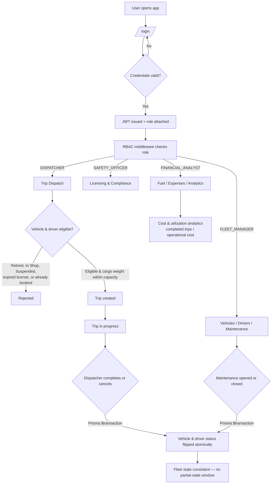

# TransitOps (Convoy)

**Smart transport operations platform** — vehicle, driver, dispatch, maintenance, fuel/expense, and analytics management with role-based access control.

Built in a hackathon sprint by a 3-person team, covering fleet/user management, trip and financial operations, and the frontend experience end to end.

---

## Table of Contents

- [Overview](#overview)
- [Tech Stack](#tech-stack)
- [Repo Layout](#repo-layout)
- [System Flow](#system-flow)
- [Prerequisites](#prerequisites)
- [Setup](#setup)
  - [1. Backend](#1-backend)
  - [2. Frontend](#2-frontend)
- [Demo Accounts](#demo-accounts)
- [Roles & Access](#roles--access)
- [Business Rules Enforced](#business-rules-enforced)
- [Known Limitations](#known-limitations)
- [Team](#team)

---

## Overview

TransitOps is a role-based fleet operations system covering the full lifecycle of a transport business:

- **Fleet & driver management** — vehicles, drivers, licensing, and maintenance records
- **Dispatch** — trip creation, assignment, and completion with real-time status enforcement
- **Fuel & expense tracking** — operational cost logging tied to vehicles and trips
- **Analytics** — fleet utilization and cost-efficiency reporting
- **Authentication & RBAC** — JWT-based auth with four distinct role permission sets

## Tech Stack

| Layer | Technology |
|---|---|
| Frontend | Next.js (App Router), Tailwind CSS, TanStack Query, React Hook Form, Recharts |
| Backend | Express + TypeScript |
| Database | PostgreSQL via Prisma ORM (**pinned to v6.19.3** — do not upgrade to Prisma 7, which drops `datasource.url` support from `schema.prisma`) |
| Auth | JWT + bcrypt, RBAC middleware (`FLEET_MANAGER`, `DISPATCHER`, `SAFETY_OFFICER`, `FINANCIAL_ANALYST`) |

## Repo Layout

```
backend/    Express API, Prisma schema + migrations, seed script
frontend/   Next.js app (all pages under app/(app)/*, login at app/login)
```

## System Flow

The diagram below shows how a request moves through the system — from login and role resolution, through RBAC-gated actions, to the atomic status updates that keep vehicle/driver state consistent.



> Rendered automatically on platforms that support Mermaid (e.g. GitHub). If viewing elsewhere, see the description above for the same flow in words.

## Prerequisites

- Node.js 18+
- A PostgreSQL database — either a hosted instance (e.g. Supabase) or a local one via Docker:

  ```bash
  docker run -d --name transitops-pg \
    -e POSTGRES_PASSWORD=postgres \
    -e POSTGRES_DB=transitops \
    -p 5432:5432 postgres:16
  ```

## Setup

### 1. Backend

```bash
cd backend
npm install
cp .env.example .env
```

Edit `backend/.env` and set `DATABASE_URL` — either your local Docker Postgres, or the team's shared hosted database (ask a teammate for the connection string; it is intentionally not committed to this repo).

```bash
npx prisma migrate deploy   # applies schema (safe to re-run)
npm run prisma:seed         # idempotent — creates demo roles/users/vehicles/drivers if missing
npm run dev                 # starts the API on http://localhost:4000
```

### 2. Frontend

```bash
cd frontend
npm install
cp .env.example .env.local   # NEXT_PUBLIC_API_URL=http://localhost:4000 by default
npm run dev                  # starts the app on http://localhost:3000
```

Open **http://localhost:3000** — it redirects to `/login`.

## Demo Accounts

All seeded accounts share the password `password123`. The login screen has one-click buttons for each of these.

| Role | Email |
|---|---|
| Fleet Manager | `fleet.manager@transitops.dev` |
| Dispatcher | `dispatcher@transitops.dev` |
| Safety Officer | `safety.officer@transitops.dev` |
| Financial Analyst | `financial.analyst@transitops.dev` |

## Roles & Access

| Role | Focus Area |
|---|---|
| **Fleet Manager** | Vehicle and driver records, maintenance oversight, org-wide visibility |
| **Dispatcher** | Trip creation, assignment, and completion/cancellation |
| **Safety Officer** | Driver licensing status, maintenance schedules, compliance |
| **Financial Analyst** | Fuel/expense logs, cost analytics, vehicle ROI reporting |

## Business Rules Enforced

- Vehicle registration numbers and driver license numbers are unique.
- Retired / In Shop vehicles and Suspended / license-expired drivers are excluded from trip dispatch.
- A vehicle or driver already on a trip cannot be double-booked.
- Cargo weight is validated against vehicle capacity.
- Dispatch → Complete/Cancel and Maintenance open/close atomically flip vehicle/driver status (wrapped in Prisma `$transaction`s, so there is no partial-state window).

## Known Limitations

- Vehicle Type, Odometer, Acquisition Cost, Driver License Category, Contact Number, and Trip Planned Distance are not modeled — the schema tracks a reduced field set relative to the original spec.
- "Vehicle ROI" is computed as a cost-efficiency proxy (`completed trips / operational cost`), since there is no revenue or acquisition-cost tracking to support the literal ROI formula.
- The topbar search box (`frontend/lib/searchindex.ts`) uses static placeholder data, not live API results.
- The Settings page has no backend — changes are not persisted.
